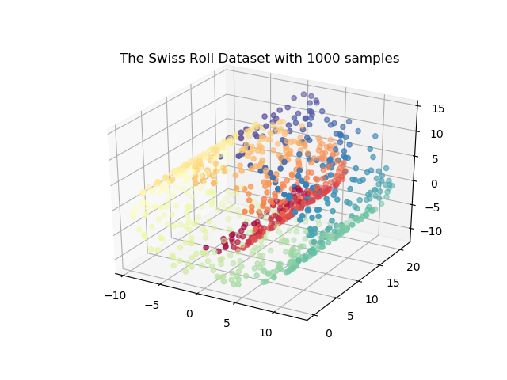
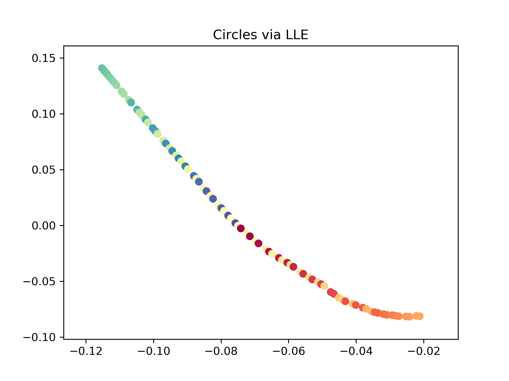

# Toy Data Sets for Seminar on Manifold Learning

LMU, Winter Semester 2020/2021

# Datasets and Dataset Creation

## Clocks

Dataset consisting of a set of circles (_clocks_) with clock hands varying clockwise. A perfect model is able to learn the 2-dimensional manifold and embed the clocks according to the clockwise ordering.

Images look as follows:

Use the script `circle_2d.py` to generate them. You can play around with various command line args such as `nrows=127`, height and width of the image, `n=20` the amount of plots to create and `delta=150` to control the thickness of the clock hands. Running the script will create a folder `circle_plots` that contains a) the plots for each of the circles and b) a `rawdata_circles.csv` containing the rawdata as flattened vectors.

As label `y` we use the angle of the clock hand w.r.t to a reference clock hand at 9'o clock.

## Swiss Roll

**The** standard data set for manifold learning problems. Use the script `swiss_roll.py` to generate swiss roll data. The task is to embedd a 3-dimensional, convolved dataset in a smaller embedding space. We can control parameters `n=1000` and `noise=0.0`. The input data looks as follows:

As label `y` we use the position according to the main dimension of each point on this manifold.

## Genome Data

From the Nature [DR Benchmark Paper](https://github.com/ebecht/DR_benchmark).

tbd

# Evaluation

## Output format

Your manifold learning script will take the above described files as an input (the rawdata as `x_1`, ..., `x_D` and the label `y`) and is expected to output the learned embedding as an .csv file with format `x_1`, ..., `x_d` and `y` where `d={2, 3}`.

Check the example file `lle_example.py` where we fit LLEs on the Circles data set.

## Visualization

Then use the file `visualize_embedding.py` to visualize your learned embedding in a standardized way. The resulting plot looks like this for 2d

and for 3-dimensional embeddings.

## Data Generation

## Evaluation the Manifold
