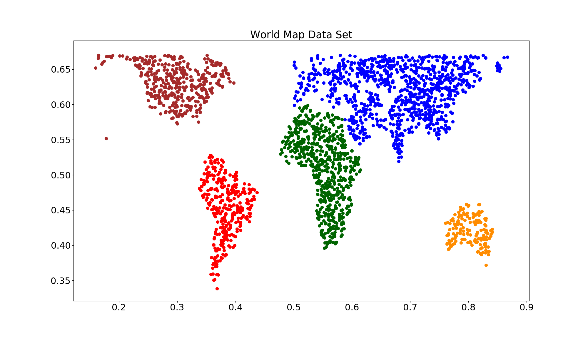
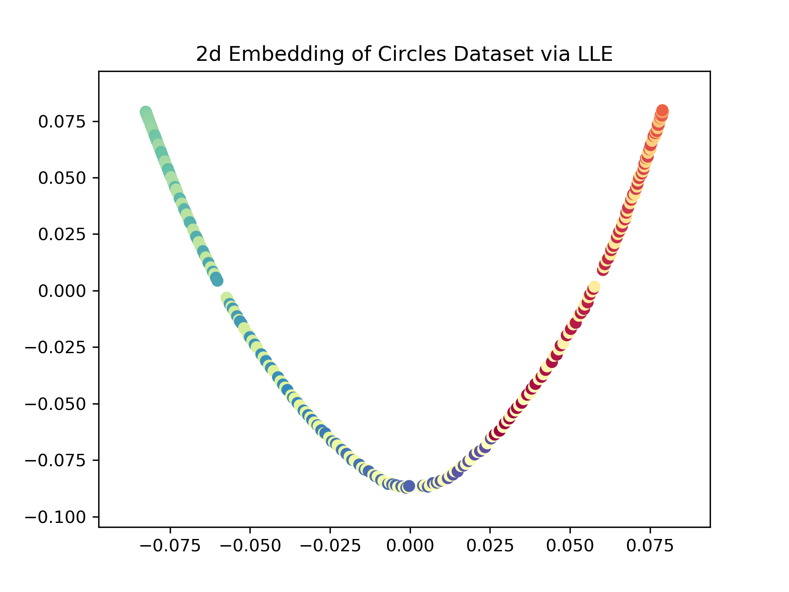
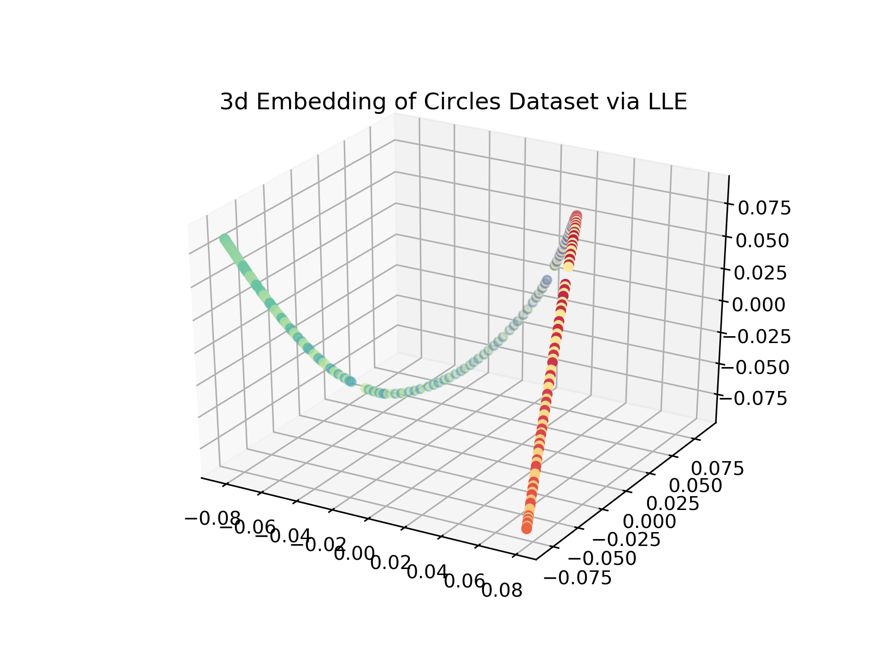

# Toy Data Sets for Seminar on Manifold Learning

Code and Datasets for the Seminar on Manifold Learning at LMU held in winter semester 2020/2021 for CS/ Stats students.

The following code allows you to a) generate the datasets that you should evaluate your methods on and b) visualize the manifold learned by this respective method in 2d and 3d in one unified format. Your job is to write a script that takes the three generated input data sets, learns a 2- and 3-dimensional embedding from that data using your method of choice and outputs this embedding(s) in below described format compatible with the evaluation and visualization script(s).

While the helper files in this repository are written in `python`, you can still implement your models in `R` as long as your code adheres to the input and output data format of this repository.

If you encounter any issues with this codebase, please do open an issue where you describe your problem in detail.

# Datasets and Dataset Creation

We investigate the performance of the different methods on three datasets.

All datasets have the format `rows=samples`, `columns=features` where the columns are named as `x_1, ..., x_dim, y` where `dim=D` for the input and `dim=d` for the resulting embedding data. The column `y` refers to the *true underlying manifold* that we want to learn.

## Clocks

Dataset consisting of a set of circles (_clocks_) with clock hands varying clockwise. A perfect model is able to learn the 2-dimensional manifold and embed the clocks according to the clockwise ordering. Resulting images look as follows:

Use the script `circle_2d.py` to generate them. You can play around with various command line args such as `nrows=127`, height and width of the image, `n=20` the amount of plots to create and `delta=150` to control the thickness of the clock hands. Running the script will create a folder `circle_plots` that contains a) the plots for each of the circles and b) a `rawdata_circles.csv` containing the rawdata as flattened vectors.

As label `y` we use the angle of the clock hand w.r.t to a reference clock hand at 9'o clock.

## Swiss Roll

**The** standard data set for manifold learning problems. Use the script `swiss_roll.py` to generate swiss roll data. The task is to embedd a 3-dimensional, convolved dataset in a smaller embedding space. We can control parameters `n=1000` and `noise=0.0`. The input data looks as follows:

As label `y` we use the position according to the main dimension of each point on this manifold.

## World Data Set

We also try to embed the world. Therefore we generated a dataset consisting of randomly sampled locations around the planet with their corresponding longitude/ latitude values. Run `world.py` to create the dataset. Unfortunately, this script requires a ton of dependencies and some hacky moves as it builds on top of `cartopy` and some underlying GIS-software. Don't try this at home. The dataset looks like this

As label `y` we use the corresponding continent of each sample.

# Evaluation

To allow for unified comparison of the different methods, we try to standardize evaluation and visualization of the different manifold learning techniques.

## Output format

Your manifold learning script will take the above described files as an input (the rawdata as `x_1`, ..., `x_D` and the label `y`) and is expected to output the learned embedding as an .csv file with format `x_1`, ..., `x_d` and `y` where `d={2, 3}`.

Check the example file `lle_example.py` where we fit LLEs on the Circles data set.

## Visualization

Then use the file `visualize_embedding.py` to visualize your learned embedding in a standardized way. The resulting plot looks like this for 2d:

and like this for 3-dimensional embeddings:

Use `visualize_embedding.py` with the command line argument `--input_path`. For instance, to create the plot for the 3-dimensional embedding of the circles dataset above, run `python visualize_embedding.py --input_path/lle_circles_3d.csv` assuming you stored your embedding results in the above described format.

# Example Code

It is your job to implement and run your method of choice on these manifold learning tasks. Refer to the script `lle_example.py` as a first example of how such an implementation could look like (simply using the `sklearn` implementation of LLE's in this case). As stated in the intro, you are also free to work with `R` for the implementation.